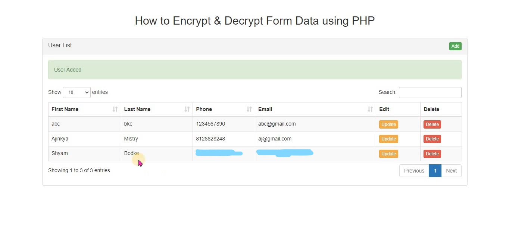
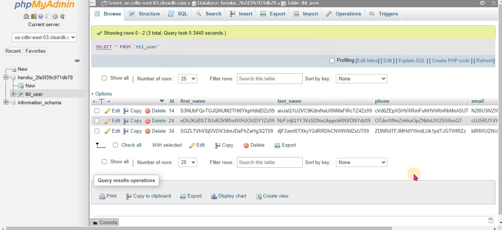

[![MIT License][license-shield]][license-url]
[![LinkedIn][linkedin-shield]][linkedin-url]

<h1 align="center">Form Data Encryption</h1>

This app encrypts form data using PHP code and then stores it into a MySQL table. For encryption and decryption string in PHP, I have used the popular AES-256 algorithm.AES uses symmetric key encryption, which involves the use of only one secret key to cipher and deciphers the information.

## Description
- We implemented two way encryption and decryption of Encrypted string. That means once we will store form data in encrypted form and then after whenever we want to display that encrypted string on their original format at that time we will decrypt that encrypted string by using PHP script and display on web page. For encryption and decryption string in PHP we have use different PHP encrypt method like AES-256-CBC. We have also use PHP hash() function for make encrypted string.We have also use different PHP function like openssl_encrypt() function for convert string to encrypted form and after this we have use base64_encode(). By using this both function we can encrypt string. For decrypt string we have use base64_decode() function and openssl_decrypt() function for decrypt encryted string.

- For Two way encryption and decryption in PHP depends on encryption key and initialization vector. If we have lost this two key then we cannot decrypt encrypted string. So string encryption is depends on this two keys. Main implementation consists of simple Insert, Update, Delete and Select data example by using PHP script with Ajax jQuery.First we will fetch encrypted data from Mysql table and convert into normal string and display on web page in jQuery Data tables. After this we will Insert form data into Mysql table. So for this we will encrypt form data and insert into Mysql table. Then after we want to update, so update first we want to fetch single user encrypted data and decrypt and display in form field. For this all crud operation we have use PHP Script with Ajax Jquery.

### Front-End Preview

### Back-End Preview

## Requirements
* #### local Env
  * 1) XAMP,LAMP,WAMP(Apache,MySQL,PHP)
* #### Cloud Env
  * 1) Apache,MySQL,PHP etc.

Note: Replace variables by your own credentials in `database_connection.php` before executing.

<!-- LICENSE -->
## License

Distributed under the MIT License. See `LICENSE` for more information.

<!-- MARKDOWN LINKS & IMAGES -->
<!-- https://www.markdownguide.org/basic-syntax/#reference-style-links -->
[license-shield]: https://img.shields.io/github/license/othneildrew/Best-README-Template.svg?style=for-the-badge
[license-url]: https://github.com/Cracked679/Form-Data-Encryption/blob/master/LICENSE.txt
[linkedin-shield]: https://img.shields.io/badge/-LinkedIn-black.svg?style=for-the-badge&logo=linkedin&colorB=555
[linkedin-url]: https://www.linkedin.com/in/shyam-bodke/